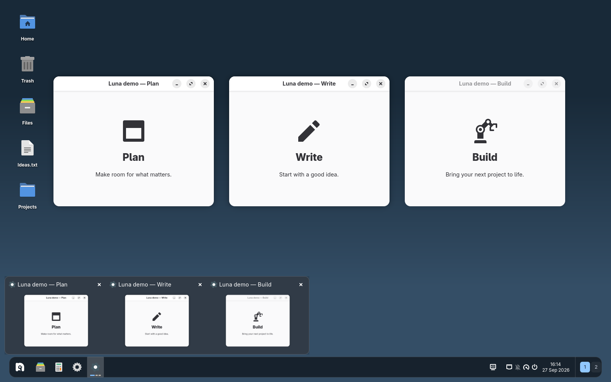
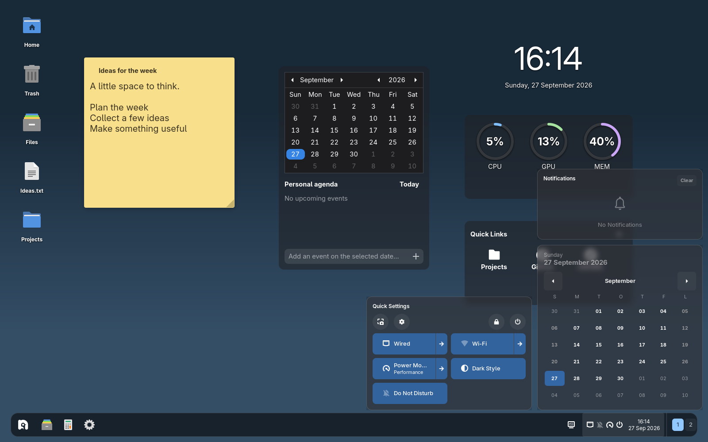
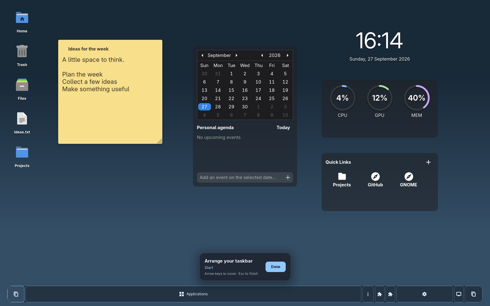

# Luna Taskbar

**Your apps, your panels, your way.**

A customizable taskbar for GNOME Shell 50 on Wayland, with grouped apps, animated window previews, a system tray, and calendar and system panels that feel at home together.



*Real screenshots from an isolated GNOME session. Preview windows contain sample content; desktop widgets in the other screenshots come from [Luna Desktop](https://github.com/Wuild/luna-desktop).*

## A taskbar that fits your desktop

- **Pick a side.** Place the bar at the bottom, top, left, or right. Float it with rounded corners and breathing room, or attach it to the screen edge.
- **Keep your windows together.** Pin favorites, group application windows, and use previews to find the one you want.
- **Move without losing your place.** Previews fade and slide, with a grace period when crossing the gap or briefly passing over a neighboring app.
- **Make every click count.** Choose what left-click, middle-click, right-click, Shift-click, and scrolling do on app buttons.
- **Use your whole setup.** Show taskbars on the primary, a specific, or all displays. With multiple taskbars, optionally show each display’s own windows.
- **Stay out of the way.** Keep the bar visible, auto-hide it, or hide it when windows overlap or maximize. Choose a different appearance near windows.
- **Keep the essentials close.** System tray, workspaces, search, Show Desktop, clock, and optional weather are all within reach.

## Panels worth opening



Open calendar, notifications, media controls, and Quick Settings in a shared style. Keep calendar and system panels separate, or bring both columns together. Customize color, transparency, blur, corners, and spacing.

Add weather for current conditions and a three-day forecast, choose Celsius or Fahrenheit, or use the smaller current-conditions view. Weather can appear in the panels or behind its own taskbar button. It uses Open-Meteo and is off by default.

## Arrange it your way



Right-click the taskbar and choose **Edit taskbar**. Move applets by dragging them or using the arrow keys, then choose **Done**. Positions are remembered.

Use the GNOME Overview launcher, or integrate an independently installed **ArcMenu**. ArcMenu is optional and is not bundled. Its menu shares Luna’s panel appearance settings.

A few things to try:

- Float the bar normally, then attach it when a window is maximized.
- Put the bar vertically beside your workspace.
- Middle-click to minimize an app group and scroll to cycle its windows.
- Add a workspace switcher, or switch workspaces by scrolling the taskbar.

All controls are available through searchable preferences. Preview timing is under **Interactions**.

## Install

Requires **GNOME Shell 50 on Wayland**. Use one panel/taskbar replacement at a time.

Build with Node.js 22+, pnpm, Python 3, and GLib schema tools:

```sh
git clone https://github.com/Wuild/luna-taskbar.git
cd luna-taskbar
pnpm install --frozen-lockfile
pnpm run pack
gnome-extensions install --force /tmp/luna-taskbar-build/luna-taskbar@wuild.shell-extension.zip
```

Log out and back in, then enable **Luna - Taskbar** in GNOME’s Extensions app, or run:

```sh
gnome-extensions enable luna-taskbar@wuild
```

After installing an update, log out and back in to load the new code. Node.js is only needed for building, not for running the installed extension.

## Build a Luna desktop

| Project | What it brings |
| --- | --- |
| [Luna Desktop](https://github.com/Wuild/luna-desktop) | Desktop shortcuts, sticky notes, clocks, media, and more widgets |
| [Luna Wallpaper](https://github.com/Wuild/luna-wallpaper) | Daily images and automatic wallpaper rotation |
| [Luna Devkit](https://github.com/Wuild/luna-devkit) | A separate GNOME session for trying and developing the extensions |

Luna Taskbar works independently; install the other pieces only if you want them.

Also from the same author: [Mutter Unmuted](https://github.com/Wuild/mutter-unmuted), an experimental, opt-in Mutter/Xwayland patch pair for legacy X11 push-to-talk across GNOME on Wayland, including Discord. It is separate from Luna and changes system components; see its compatibility and input-forwarding notes.

## Development and feedback

```sh
pnpm typecheck
pnpm test
pnpm test:shell
pnpm test:interactions
```

Shell tests use a disposable headless GNOME session. [Luna Devkit](https://github.com/Wuild/luna-devkit) provides an interactive test desktop. Build output lives in `dist/`; settings are defined in the XML schema.

[Report an issue or share an idea](https://github.com/Wuild/luna-taskbar/issues). Include your distribution, GNOME version, monitor/scaling setup, enabled extensions, and reproduction steps.

## License

Copyright © 2026 Wuild. Licensed under [GPL-2.0-or-later](LICENSE). You are welcome to use, study, modify, and redistribute it under those terms.
